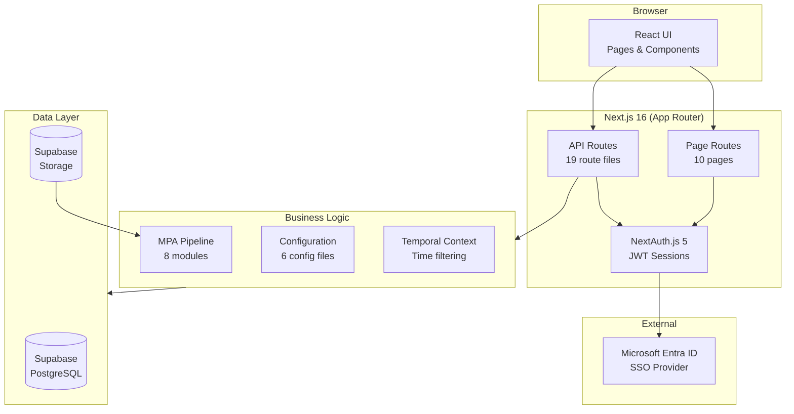
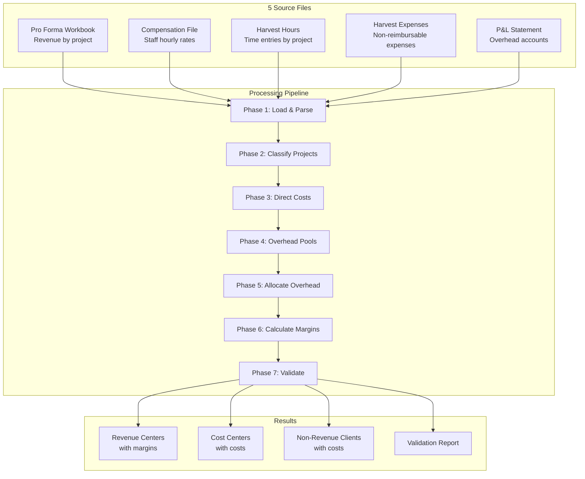
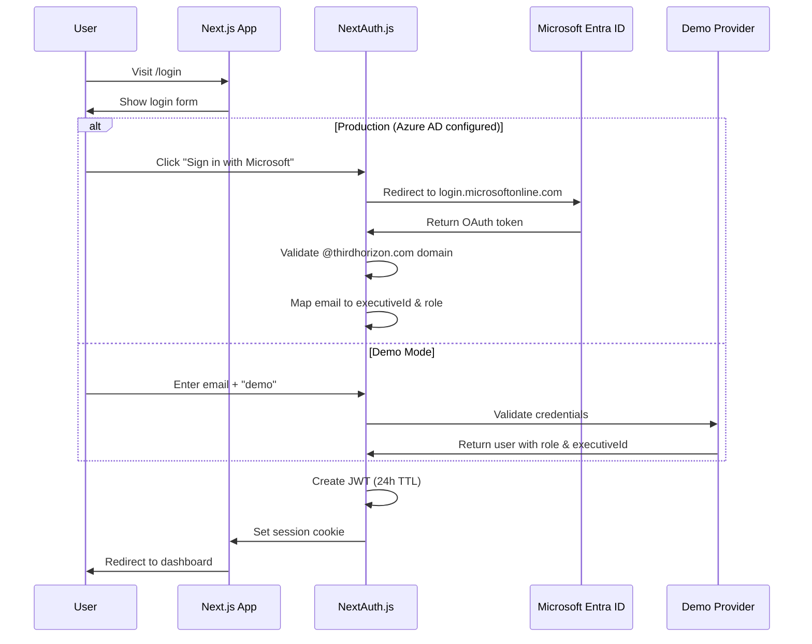
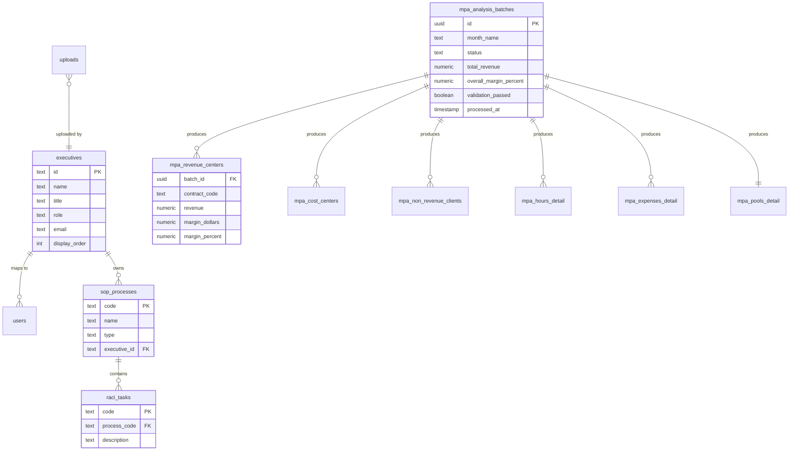

# Third Horizon Executive Dashboard

Web application for CSOG (Chief Strategies & Operations Group) members to monitor firm operational health, aligned with Third Horizon Standard Operating Procedures.


**Repo:** [github.com/thtopher/th-csog-dashboard](https://github.com/thtopher/th-csog-dashboard)
**Version:** v2.1 (January 2026)

---

## Table of Contents

1. [Overview](#overview)
2. [Tech Stack](#tech-stack)
3. [Architecture](#architecture)
4. [Quick Start](#quick-start)
5. [Environment Configuration](#environment-configuration)
6. [Project Structure](#project-structure)
7. [Application Pages](#application-pages)
8. [API Routes](#api-routes)
9. [Monthly Performance Analysis](#monthly-performance-analysis)
10. [Authentication & Authorization](#authentication--authorization)
11. [Database Schema](#database-schema)
12. [Configuration Data](#configuration-data)
13. [Implementation Status](#implementation-status)
14. [Development](#development)

---

## Overview

The dashboard provides five primary capabilities:

- **CEO Scorecard** — Firm-level performance across 6 categories (Pipeline Health, Delivery Health, Margin, Cash, Staffing Capacity, Strategic Initiatives) with red/amber/green status indicators.
- **Executive Views** — Dedicated dashboards for each of 7 C-Suite executives showing owned processes, RACI tasks, and domain-specific KPIs.
- **Monthly Performance Analysis (MPA)** — Project-level margin analysis with overhead allocation. Ingests 5 Excel files, classifies projects, allocates SG&A/Data/Workplace overhead pools pro-rata by revenue, and produces margin reports.
- **Upload Management** — Calendar-based upload tracking with compliance status, role-based permissions, and file storage via Supabase Storage.
- **Admin Panel** — System administration with upload oversight, user management, and operational rhythm compliance.

---

## Tech Stack

### Core Framework

| Package | Version | Purpose |
|---------|---------|---------|
| `next` | 16.1.1 | App Router, API routes, SSR |
| `react` / `react-dom` | 19.2.3 | UI rendering |
| `typescript` | ^5 | Type safety |

### UI & Styling

| Package | Version | Purpose |
|---------|---------|---------|
| `tailwindcss` | ^4 | Utility-first CSS |
| `@radix-ui/react-dialog` | ^1.1.15 | Modal dialogs |
| `@radix-ui/react-dropdown-menu` | ^2.1.16 | Dropdown menus |
| `@radix-ui/react-select` | ^2.2.6 | Select inputs |
| `@radix-ui/react-tabs` | ^1.1.13 | Tab navigation |
| `@radix-ui/react-tooltip` | ^1.2.8 | Tooltips |
| `recharts` | ^3.6.0 | Data visualization |
| `lucide-react` | ^0.562.0 | Icons |
| `clsx` | ^2.1.1 | Conditional class names |
| `tailwind-merge` | ^3.4.0 | Tailwind class merging |

### Backend & Data

| Package | Version | Purpose |
|---------|---------|---------|
| `@supabase/supabase-js` | ^2.91.0 | PostgreSQL + Storage |
| `next-auth` | ^5.0.0-beta.30 | Authentication (SSO + demo) |
| `@auth/core` | ^0.41.0 | Auth core library |
| `xlsx` | ^0.18.5 | Excel file parsing (SheetJS) |
| `date-fns` | ^4.1.0 | Date utilities |

### Dev Tools

| Package | Version | Purpose |
|---------|---------|---------|
| `vitest` | ^3.2.4 | Test runner |
| `@vitejs/plugin-react` | ^5.1.2 | React plugin for Vitest |
| `eslint` | ^9 | Linting |
| `eslint-config-next` | 16.1.1 | Next.js ESLint rules |
| `@tailwindcss/postcss` | ^4 | PostCSS integration |

---

## Architecture

### System Architecture



### Data Upload Flow


---

## Quick Start

### Prerequisites

- Node.js 18+
- npm
- Supabase account (for database and storage)

### Setup

```bash
# Clone and install
git clone https://github.com/thtopher/th-csog-dashboard.git
cd th-csog-dashboard
npm install

# Create environment file
cp .env.example .env.local
# Edit .env.local with your values (see Environment Configuration)

# Start development server
npm run dev
```

Open [http://localhost:3000](http://localhost:3000).

### Database Setup

1. Create a new Supabase project.
2. Go to SQL Editor and run migrations in order:
   - `database/migrations/001_initial_schema.sql`
   - `database/migrations/002_sop_alignment.sql`
   - `database/migrations/003_onboarding_uploads.sql`
   - `database/migrations/004_file_storage.sql`
   - `database/migrations/005_monthly_performance_analysis.sql`
3. Optionally run seed files (`database/seeds/001_initial_data.sql` through `006_ceo_scorecard_kpis.sql`).
4. Create a storage bucket named `uploads`.

### Run Tests

```bash
npm run test        # Single run
npm run test:watch  # Watch mode
```

---

## Environment Configuration

Copy `.env.example` to `.env.local`:

| Variable | Required | Description |
|----------|----------|-------------|
| `NEXT_PUBLIC_SUPABASE_URL` | Yes | Supabase project URL |
| `NEXT_PUBLIC_SUPABASE_ANON_KEY` | Yes | Supabase anon/public key |
| `SUPABASE_SERVICE_ROLE_KEY` | Yes | Supabase service role key (server-side only) |
| `NEXTAUTH_SECRET` | Yes | Random string for session encryption (`openssl rand -base64 32`) |
| `NEXTAUTH_URL` | Yes | Application URL (e.g., `http://localhost:3000`) |
| `NEXT_PUBLIC_DEMO_MODE` | No | Set to `true` to enable demo login |
| `AZURE_AD_CLIENT_ID` | No | Microsoft Entra ID application client ID |
| `AZURE_AD_CLIENT_SECRET` | No | Microsoft Entra ID client secret |
| `AZURE_AD_TENANT_ID` | No | Microsoft Entra ID tenant ID |

**Demo mode** activates automatically when `NEXT_PUBLIC_DEMO_MODE=true` or when `AZURE_AD_CLIENT_ID` is not set. In demo mode, any known email with password `demo` authenticates successfully.

**Production mode** requires all three Azure AD variables. Only `@thirdhorizon.com` email addresses are permitted.

---

## Project Structure

```
th-csog-dashboard/
├── src/
│   ├── app/
│   │   ├── layout.tsx                         # Root layout
│   │   ├── providers.tsx                      # Context providers wrapper
│   │   ├── page.tsx                           # CEO Scorecard (/)
│   │   ├── globals.css                        # Global styles
│   │   ├── admin/page.tsx                     # Admin panel
│   │   ├── login/page.tsx                     # Authentication page
│   │   ├── settings/page.tsx                  # User settings
│   │   ├── onboarding/page.tsx                # First-run setup wizard
│   │   ├── upload/page.tsx                    # Data upload page
│   │   ├── docs/excel-templates/page.tsx      # Excel template documentation
│   │   ├── executive/[executiveId]/page.tsx   # Executive detail view
│   │   ├── monthly-performance/
│   │   │   ├── page.tsx                       # MPA upload wizard
│   │   │   └── [batchId]/page.tsx             # MPA results view
│   │   └── api/
│   │       ├── health/route.ts
│   │       ├── auth/[...nextauth]/route.ts
│   │       ├── executives/route.ts
│   │       ├── executives/[id]/route.ts
│   │       ├── metrics/route.ts
│   │       ├── kpis/process/[processId]/route.ts
│   │       ├── uploads/compliance/route.ts
│   │       ├── uploads/[id]/route.ts
│   │       ├── annotations/route.ts
│   │       ├── data/upload/route.ts
│   │       ├── data/proforma-confirm/route.ts
│   │       ├── storage/upload/route.ts
│   │       ├── onboarding/state/route.ts
│   │       ├── onboarding/complete/route.ts
│   │       └── mpa/batches/
│   │           ├── route.ts
│   │           └── [id]/
│   │               ├── route.ts
│   │               ├── process/route.ts
│   │               ├── results/route.ts
│   │               └── detail/[type]/[code]/route.ts
│   ├── components/
│   │   ├── common/                            # Avatar, StatusBadge, TrendIndicator,
│   │   │                                      # CodeTooltip, DataSourceBadge, TemporalBanner
│   │   ├── layout/                            # Header, Breadcrumbs
│   │   ├── dashboard/                         # CEOScorecard, ExecutiveScorecard,
│   │   │                                      # ExecutiveTile, ExecutiveUploadStatus,
│   │   │                                      # GlobalFilters, OperatingRhythmView,
│   │   │                                      # AdminOverview, ScorecardDetailModal, StatCardModal
│   │   ├── monthly-performance/               # MPAUploadWizard, MPAResultsSummary,
│   │   │                                      # MPARevenueTable, MPAProjectDetail,
│   │   │                                      # MPAValidationReport
│   │   ├── onboarding/                        # OnboardingWelcome, OnboardingProgress,
│   │   │                                      # OnboardingBaseline, OnboardingChecklist,
│   │   │                                      # OnboardingUpload, OnboardingComplete
│   │   ├── uploads/                           # BulkUploadModal, SpreadsheetViewer,
│   │   │                                      # ProFormaConfirmation
│   │   ├── upload/                            # ColumnMapper, UploadPreview, ValidationSummary
│   │   ├── timeline/                          # MonthlyTimeline, TimelineLegend,
│   │   │                                      # UploadCalendarCell, CalendarDayModal
│   │   ├── progress/                          # UploadStatusBadge
│   │   ├── raci/                              # RACIMatrix, CompactRACILegend
│   │   ├── process/                           # KPIChart
│   │   └── domain/                            # (empty, reserved)
│   ├── config/
│   │   ├── executives.ts                      # 7 C-Suite members, colors, photos
│   │   ├── executiveScorecards.ts             # Per-executive scorecard categories & KPIs
│   │   ├── processDefinitions.ts              # 52 process/function codes
│   │   ├── uploadTypes.ts                     # 20 upload types (15 standard + 5 MPA)
│   │   ├── uploadSchedule.ts                  # Upload cadence schedule (13 items)
│   │   └── domains.ts                         # Email domain whitelist
│   ├── contexts/
│   │   ├── AuthContext.tsx                     # User auth state & session
│   │   └── TemporalContext.tsx                 # Time period filtering
│   ├── lib/
│   │   ├── auth/config.ts                     # NextAuth config (SSO + demo mode)
│   │   ├── supabase/
│   │   │   ├── client.ts                      # Browser client
│   │   │   ├── server.ts                      # Server client
│   │   │   ├── storage.ts                     # File storage operations
│   │   │   └── types.ts                       # Supabase type definitions
│   │   ├── upload/
│   │   │   ├── parser.ts                      # Excel file parsing
│   │   │   ├── mapper.ts                      # Column mapping
│   │   │   ├── validator.ts                   # Data validation
│   │   │   ├── schemas.ts                     # Zod validation schemas
│   │   │   └── scheduleUtils.ts               # Upload schedule utilities
│   │   ├── metrics/calculateMetrics.ts        # Metric computation
│   │   ├── mpa/                               # MPA Processing Pipeline (see §9)
│   │   │   ├── process.ts                     # Main orchestrator
│   │   │   ├── loaders.ts                     # 5-file Excel parsing
│   │   │   ├── classification.ts              # Revenue/Cost/Non-Revenue classification
│   │   │   ├── allocations.ts                 # Overhead pool allocation
│   │   │   ├── computations.ts                # Direct cost calculations
│   │   │   ├── validators.ts                  # Validation checks
│   │   │   ├── config.ts                      # Category mappings, cost centers, P&L rules
│   │   │   └── types.ts                       # TypeScript interfaces
│   │   └── utils/
│   │       ├── cn.ts                          # Tailwind class name utility
│   │       ├── format.ts                      # Number/date formatting
│   │       └── dataSourceMapping.ts           # Upload type mapping
│   ├── types/
│   │   ├── index.ts                           # Shared type definitions
│   │   └── next-auth.d.ts                     # NextAuth type augmentation
│   └── __tests__/
│       ├── calculateMetrics.test.ts
│       └── executiveScorecards.test.ts
├── database/
│   ├── migrations/                            # 5 SQL migration files
│   │   ├── 001_initial_schema.sql             # executives, users, uploads
│   │   ├── 002_sop_alignment.sql              # SOP processes, RACI tasks
│   │   ├── 003_onboarding_uploads.sql         # Onboarding tracking
│   │   ├── 004_file_storage.sql               # File storage metadata
│   │   └── 005_monthly_performance_analysis.sql
│   └── seeds/                                 # 6 seed files
│       ├── 001_initial_data.sql
│       ├── 002_executives.sql                 # 7 executives
│       ├── 003_sop_processes.sql              # SOP processes
│       ├── 004_sop_tasks.sql                  # 154 RACI tasks
│       ├── 005_raci_assignments.sql           # RACI matrix
│       └── 006_ceo_scorecard_kpis.sql
├── public/
│   └── headshots/                             # Executive photos
├── vercel.json                                # Deployment configuration
└── package.json
```

---

## Application Pages

| Route | Access | Description |
|-------|--------|-------------|
| `/` | All authenticated | CEO Scorecard. 6 performance categories with red/amber/green indicators. Executive tiles link to individual dashboards. |
| `/executive/[executiveId]` | All authenticated | Executive detail view. Owned processes, RACI matrix, domain-specific scorecard metrics. |
| `/monthly-performance` | CFO, CEO, President, COO, Admin | MPA upload wizard. 5-step file upload with progress tracking. |
| `/monthly-performance/[batchId]` | CFO, CEO, President, COO, Admin | MPA results. Summary metrics, revenue center table, drill-down, validation report. |
| `/upload` | CSOG members, Admin | Data upload page. Type-specific upload forms, column mapping, preview. |
| `/admin` | Admin only | Admin panel. Upload compliance overview, user management. |
| `/onboarding` | All authenticated | First-run setup wizard. 6-step onboarding flow. |
| `/settings` | All authenticated | User settings page. |
| `/login` | Unauthenticated | Authentication page. SSO button or demo email/password form. |
| `/docs/excel-templates` | All authenticated | Excel template documentation and download links. |

---

## API Routes

### Authentication

| Method | Endpoint | Description |
|--------|----------|-------------|
| GET/POST | `/api/auth/[...nextauth]` | NextAuth.js handler (SSO + demo credentials) |

### Dashboard

| Method | Endpoint | Description |
|--------|----------|-------------|
| GET | `/api/health` | Health check |
| GET | `/api/executives` | All executives with scorecard data |
| GET | `/api/executives/[id]` | Single executive detail |
| PUT | `/api/executives/[id]` | Update executive data |
| GET | `/api/metrics` | Dashboard metrics (stub) |
| GET | `/api/kpis/process/[processId]` | KPIs for a specific process (stub) |
| GET/POST | `/api/annotations` | Scorecard annotations (stub) |

### Onboarding

| Method | Endpoint | Description |
|--------|----------|-------------|
| GET | `/api/onboarding/state` | Get onboarding progress state |
| POST | `/api/onboarding/complete` | Mark onboarding as complete |

### Uploads

| Method | Endpoint | Description |
|--------|----------|-------------|
| GET | `/api/uploads/compliance` | Upload compliance by period |
| GET/PUT | `/api/uploads/[id]` | Individual upload record |
| POST | `/api/storage/upload` | Upload file to Supabase Storage |
| POST | `/api/data/upload` | Process uploaded data file |
| POST | `/api/data/proforma-confirm` | Confirm Pro Forma key values |

### Monthly Performance Analysis

| Method | Endpoint | Description |
|--------|----------|-------------|
| GET | `/api/mpa/batches` | List MPA batches |
| POST | `/api/mpa/batches` | Create new batch |
| GET | `/api/mpa/batches/[id]` | Get batch details |
| PATCH | `/api/mpa/batches/[id]` | Update batch (file paths) |
| POST | `/api/mpa/batches/[id]/process` | Run analysis pipeline |
| GET | `/api/mpa/batches/[id]/results` | Get analysis results |
| GET | `/api/mpa/batches/[id]/detail/[type]/[code]` | Drill-down by type and code |

---

## Monthly Performance Analysis

The MPA pipeline computes project-level profitability by combining revenue data from the Pro Forma with labor costs from Harvest hours and compensation, direct expenses from Harvest, and overhead allocations from the P&L statement.

The TypeScript implementation in `src/lib/mpa/` mirrors the standalone Python analysis at `thtopher/TH Monthly Performance Analysis` with identical classification, allocation, and validation logic.

### Pipeline Flow



### Input Files

#### 1. Pro Forma Workbook (`loaders.ts:loadProForma`)

- **Sheet name:** `PRO FORMA 2025`
- **Structure:** Header row containing month abbreviations (Jan, Feb, Mar...). Column A = allocation tag (`Data` or `Wellness`), Column B = project name or section header, Column C = contract code.
- **Parsing:** Finds the header row by scanning for Jan/Feb/Mar sequence. Locates the month column by abbreviation. Section headers (B filled, C empty) set the current section. Project rows (B and C filled) are parsed with revenue from the month column.
- **Aggregation:** Duplicate contract codes are aggregated (revenue summed). Allocation tag conflicts (`Data` + `Wellness` on same code) cause a hard error.
- **Validation:** Calculated revenue sum must match the "Base Revenue" / "Forecasted Revenue" row within $0.01.

#### 2. Compensation File (`loaders.ts:loadCompensation`)

- **Required column:** `Last Name` (used as staff key)
- **Strategy A:** If `Base Cost Per Hour` column exists, read directly.
- **Strategy B:** Otherwise, compute from `Total` column or sum of components (`Base Compensation`, `Company Taxes Paid`, `ICHRA Contribution`, `401k Match`, `Executive Assistant`, `Well Being Card`, `Travel & Expenses`) divided by 216.6667 hours/month.
- **Constraint:** Last names must be unique (duplicates cause a hard error).

#### 3. Harvest Hours (`loaders.ts:loadHarvestHours`)

- **Required columns:** `Date`, `Project Code`, `Hours`, `Last Name`
- **Optional column:** `Project` / `Project Name` / `Client Name`
- **Filtering:** Only rows within the target month are included. Rows outside the month range are excluded with a log entry.
- **Join key:** `Last Name` links to Compensation file for hourly cost lookup.

#### 4. Harvest Expenses (`loaders.ts:loadHarvestExpenses`)

- **Required columns:** `Date`, `Project Code`, `Amount`, `Billable`
- **Optional column:** `Notes` / `Description`
- **Filtering:** Reimbursable expenses (`Billable=Yes`) are excluded. Unknown billable values are treated as non-reimbursable and included.

#### 5. P&L Statement (`loaders.ts:loadPnL`)

- **Sheet name:** `IncomeStatement`
- **Structure:** Column A = account name, last column (or column with "Total" header) = amount.
- **Exclusions:** Income lines (sales, fixed fee, recurring revenue), summary lines (gross profit, net income, total expenses), and total rows (`Total - ...`) are excluded before tagging.
- **Tagging:** Each account is matched against `PNL_ACCOUNT_TAGS` rules (exact, contains, regex) into one of 4 buckets: `DATA`, `WORKPLACE`, `NIL`, `SGA`. Unmatched accounts default to `SGA`.

### Processing Phases

**Phase 1: Load & Parse** — All 5 files are downloaded from Supabase Storage and parsed using SheetJS. Each loader validates structure and returns typed arrays.

**Phase 2: Classify** — Every contract code is classified into exactly one of three categories:
- **Revenue Center** — Appears in Pro Forma with revenue > 0
- **Cost Center** — Listed in `COST_CENTERS` config or starts with `THS-` prefix (and not in Pro Forma)
- **Non-Revenue Client** — Has activity (hours or expenses) but is neither revenue center nor cost center

A code appearing as both revenue center and cost center (from config) raises a hard error.

**Phase 3: Direct Costs** — Hours records are joined with compensation records on `staffKey` (Last Name). Staff missing compensation records are excluded with a warning. Labor and expense costs are aggregated by contract code and merged into the revenue center, cost center, and non-revenue client tables.

**Phase 4: Overhead Pools** — Three overhead pools are calculated from P&L buckets plus cost center labor/expense costs.

**Phase 5: Allocate Overhead** — Each pool is allocated to revenue centers pro-rata by revenue. SG&A applies to all revenue centers. Data applies only to Data-tagged centers. Workplace applies only to Wellness-tagged centers. Each allocation is verified to reconcile to its pool within $0.01.

**Phase 6: Calculate Margins** — Net margin is computed for each revenue center after all allocations.

**Phase 7: Validate** — Five validation categories are checked: data completeness, key integrity, pool reasonableness, mathematical reconciliations, and reasonableness warnings.

### Financial Calculations

#### Hourly Cost Conversion (Strategy B)

When the compensation file lacks a direct hourly rate:

$$
\text{hourlyCost} = \frac{\text{monthlyCost}}{216.6667}
$$

where `monthlyCost` is either the `Total` column or the sum of 7 component columns. The constant 216.6667 represents expected hours per month.

#### Direct Labor Cost

For each time entry, labor cost is computed as:

$$
\text{laborCost}_i = \text{hours}_i \times \text{hourlyCost}_i
$$

Aggregated per project:

$$
\text{totalLaborCost}_p = \sum_{i \in p} \text{hours}_i \times \text{hourlyCost}_i
$$

#### Overhead Pool Calculation

Three pools are assembled from P&L buckets and cost center costs:

$$
\text{sgaPool} = \sum_{a \in \text{SGA}} \text{amount}_a + \sum_{cc \in \text{SGA}} \text{totalCost}_{cc}
$$

$$
\text{dataPool} = \sum_{a \in \text{DATA}} \text{amount}_a + \sum_{cc \in \text{DATA}} \text{totalCost}_{cc}
$$

$$
\text{workplacePool} = \sum_{a \in \text{WORKPLACE}} \text{amount}_a
$$

The workplace pool does not include cost center costs. Accounts tagged `NIL` (depreciation, amortization, interest, income tax) are excluded from all pools.

#### SG&A Allocation

Allocated to **all** revenue centers pro-rata by revenue:

$$
\text{sgaAllocation}_i = \frac{\text{revenue}_i}{\sum_j \text{revenue}_j} \times \text{sgaPool}
$$

#### Data Infrastructure Allocation

Allocated only to **Data-tagged** revenue centers:

$$
\text{dataAllocation}_i =
\begin{cases}
\dfrac{\text{revenue}_i}{\sum_{j \in \text{Data}} \text{revenue}_j} \times \text{dataPool} & \text{if tag}_i = \text{Data} \\[8pt]
0 & \text{otherwise}
\end{cases}
$$

#### Workplace Well-Being Allocation

Allocated only to **Wellness-tagged** revenue centers:

$$
\text{workplaceAllocation}_i =
\begin{cases}
\dfrac{\text{revenue}_i}{\sum_{j \in \text{Wellness}} \text{revenue}_j} \times \text{workplacePool} & \text{if tag}_i = \text{Wellness} \\[8pt]
0 & \text{otherwise}
\end{cases}
$$

#### Net Margin

Per revenue center:

$$
\text{marginDollars}_i = \text{revenue}_i - \text{laborCost}_i - \text{expenseCost}_i - \text{sgaAllocation}_i - \text{dataAllocation}_i - \text{workplaceAllocation}_i
$$

$$
\text{marginPercent}_i = \frac{\text{marginDollars}_i}{\text{revenue}_i} \times 100
$$

#### Overall Margin

$$
\text{overallMarginPercent} = \frac{\sum_i \text{marginDollars}_i}{\sum_i \text{revenue}_i} \times 100
$$

### Output Data

The pipeline produces 6 output tables stored in Supabase:

**`mpa_revenue_centers`** — One row per revenue-generating project.

| Column | Type | Description |
|--------|------|-------------|
| `contract_code` | text | Project contract code |
| `project_name` | text | Project name from Pro Forma |
| `proforma_section` | text | Pro Forma section header |
| `analysis_category` | text | Category (BEH, PAD, MAR, WWB, CMH) |
| `allocation_tag` | text | `Data`, `Wellness`, or empty |
| `revenue` | numeric | Monthly revenue |
| `hours` | numeric | Total hours worked |
| `labor_cost` | numeric | Direct labor cost |
| `expense_cost` | numeric | Direct expense cost |
| `sga_allocation` | numeric | SG&A overhead share |
| `data_allocation` | numeric | Data overhead share |
| `workplace_allocation` | numeric | Workplace overhead share |
| `margin_dollars` | numeric | Net margin in dollars |
| `margin_percent` | numeric | Net margin percentage |

**`mpa_cost_centers`** — One row per overhead cost center.

| Column | Type | Description |
|--------|------|-------------|
| `contract_code` | text | Cost center code |
| `description` | text | Description |
| `pool` | text | Overhead pool (`SGA` or `DATA`) |
| `hours` | numeric | Hours logged |
| `labor_cost` | numeric | Labor cost |
| `expense_cost` | numeric | Expense cost |
| `total_cost` | numeric | Total cost (labor + expenses) |

**`mpa_non_revenue_clients`** — Projects with activity but no revenue.

| Column | Type | Description |
|--------|------|-------------|
| `contract_code` | text | Project code |
| `project_name` | text | Name from hours data |
| `hours` | numeric | Hours logged |
| `labor_cost` | numeric | Labor cost |
| `expense_cost` | numeric | Expense cost |
| `total_cost` | numeric | Total cost |

**`mpa_hours_detail`** — Per-employee hours breakdown for drill-down.

| Column | Type | Description |
|--------|------|-------------|
| `contract_code` | text | Project code |
| `staff_key` | text | Employee last name |
| `hours` | numeric | Hours worked |
| `hourly_cost` | numeric | Employee hourly rate |
| `labor_cost` | numeric | hours x hourly_cost |

**`mpa_expenses_detail`** — Individual expense line items.

| Column | Type | Description |
|--------|------|-------------|
| `contract_code` | text | Project code |
| `expense_category` | text | Category (nullable) |
| `notes` | text | Expense description |
| `amount` | numeric | Expense amount |
| `is_billable` | boolean | Always false (reimbursable excluded) |

**`mpa_pools_detail`** — Overhead pool breakdown (one row per batch).

| Column | Type | Description |
|--------|------|-------------|
| `sga_from_pnl` | numeric | SG&A from P&L accounts |
| `data_from_pnl` | numeric | Data from P&L accounts |
| `workplace_from_pnl` | numeric | Workplace from P&L accounts |
| `nil_excluded` | numeric | NIL bucket total (excluded) |
| `sga_from_cc` | numeric | SG&A from cost center costs |
| `data_from_cc` | numeric | Data from cost center costs |
| `total_revenue` | numeric | Sum of all revenue |
| `data_tagged_revenue` | numeric | Revenue from Data-tagged projects |
| `wellness_tagged_revenue` | numeric | Revenue from Wellness-tagged projects |

---

## Authentication & Authorization

### Auth Flow



### Demo Accounts

When `NEXT_PUBLIC_DEMO_MODE=true`, these accounts are available (password: `demo`):

| Email | Name | Role | Executive ID | Title |
|-------|------|------|--------------|-------|
| david@thirdhorizon.com | David Smith | admin | exec-ceo | CEO |
| greg@thirdhorizon.com | Greg Williams | csog_member | exec-president | President |
| jordana@thirdhorizon.com | Jordana Choucair | csog_member | exec-coo | COO |
| aisha@thirdhorizon.com | Aisha Waheed | csog_member | exec-cfo | CFO |
| chris@thirdhorizon.com | Chris Hart | csog_member | exec-cdao | CDAO |
| cheryl@thirdhorizon.com | Cheryl Matochik | csog_member | exec-cgo | CGO |
| ashley@thirdhorizon.com | Ashley DeGarmo | csog_member | exec-cso | CSO |
| topher@thirdhorizon.com | Topher Rasmussen | admin | — | System Administrator |
| demo@thirdhorizon.com | Demo User | staff | — | — |

### Roles

| Role | Dashboard | Executive Views | Upload | MPA | Admin |
|------|-----------|-----------------|--------|-----|-------|
| `admin` | Full | All | All types | Full | Full |
| `csog_member` | Full | Own + others (read) | Own types | If exec is CFO/CEO/President/COO | No |
| `staff` | Read-only | Read-only | No | No | No |

### Session

- Strategy: JWT
- TTL: 24 hours
- Custom claims: `id`, `email`, `name`, `role`, `executiveId`, `title`
- Production sign-in restricted to `@thirdhorizon.com` domain

---

## Database Schema

### Entity Relationships



### Migrations

| File | Purpose |
|------|---------|
| `001_initial_schema.sql` | Base tables: `executives`, `users`, `uploads` |
| `002_sop_alignment.sql` | `sop_processes` (52 codes), `raci_tasks` (154 tasks) |
| `003_onboarding_uploads.sql` | Onboarding tracking tables |
| `004_file_storage.sql` | File storage metadata |
| `005_monthly_performance_analysis.sql` | MPA tables: `mpa_analysis_batches`, `mpa_revenue_centers`, `mpa_cost_centers`, `mpa_non_revenue_clients`, `mpa_hours_detail`, `mpa_expenses_detail`, `mpa_pools_detail` |

### Seeds

| File | Purpose |
|------|---------|
| `001_initial_data.sql` | Base data setup |
| `002_executives.sql` | 7 C-Suite members |
| `003_sop_processes.sql` | SOP process definitions |
| `004_sop_tasks.sql` | 154 RACI tasks |
| `005_raci_assignments.sql` | RACI matrix assignments |
| `006_ceo_scorecard_kpis.sql` | CEO scorecard KPI definitions |

---

## Configuration Data

### Executives (7)

| ID | Name | Title | Role | Email |
|----|------|-------|------|-------|
| `exec-ceo` | David Smith | CEO | Business Oversight | david@thirdhorizon.com |
| `exec-president` | Greg Williams | President | Client Operations | greg@thirdhorizon.com |
| `exec-coo` | Jordana Choucair | COO | Business Operations | jordana@thirdhorizon.com |
| `exec-cfo` | Aisha Waheed | CFO | Finance | aisha@thirdhorizon.com |
| `exec-cdao` | Chris Hart | CDAO | Data Systems & IT | chris@thirdhorizon.com |
| `exec-cgo` | Cheryl Matochik | CGO | Growth | cheryl@thirdhorizon.com |
| `exec-cso` | Ashley DeGarmo | CSO | Client Engagement | ashley@thirdhorizon.com |

### CEO Scorecard Categories (6)

| ID | Category | Source Process | Source Executive |
|----|----------|---------------|-----------------|
| `pipeline` | Pipeline Health | BD | CGO |
| `delivery` | Delivery Health | SD | CSO |
| `margin` | Margin | CP | CSO |
| `cash` | Cash | CF | President |
| `staffing` | Staffing Capacity | ST | COO |
| `strategic` | Strategic Initiatives | F-SP | CEO |

### SOP Processes & Functions (52 total)

| Executive | Processes | Functions | Total |
|-----------|-----------|-----------|-------|
| CEO | — | F-EOC, F-CAI, F-QAD, F-PEM, F-SP, F-CRC, F-CPE | 7 |
| President | CF, CR, TP, EM, PA, VM | F-IP, F-OC, F-ER, F-KM | 10 |
| COO | OC, WD, TM, ST, EO, ES, ET, PM, TC | F-BOM, F-BI, F-BA, F-EH, F-TLG | 14 |
| CFO | AR, AP, MC, FR, IM, SM | — | 6 |
| CDAO | SA, HMRF, DDD, IAM | F-IT | 5 |
| CGO | BD, TL, MKT | — | 3 |
| CSO | SD, CP, CC, CiS, CA, CFP | F-CDH | 7 |

### Upload Types (20 total)

**Standard uploads (15):**

| ID | Name | Executive(s) | Cadence |
|----|------|-------------|---------|
| `excel_harvest` | Harvest Compliance | COO | Weekly |
| `excel_training` | Training Status | COO | Monthly |
| `excel_staffing` | Staffing & Utilization | COO | Monthly |
| `excel_ar` | Accounts Receivable Aging | CFO | Monthly |
| `excel_ap` | Accounts Payable | CFO | Monthly |
| `excel_month_close` | Month-End Close | CFO | Monthly |
| `excel_cash` | Cash Position | President | Weekly |
| `excel_pipeline` | BD Pipeline | CGO | Monthly |
| `notion_pipeline` | Pipeline Export (Notion) | CGO, CEO | — |
| `excel_delivery` | Delivery Tracking | CSO | Monthly |
| `excel_client_satisfaction` | Client Satisfaction | CSO | Quarterly |
| `excel_starset` | Starset Analytics | CDAO | Monthly |
| `excel_hmrf` | HMRF Database | CDAO | Monthly |
| `excel_strategic` | Strategic Initiatives | CEO | Quarterly |
| `excel_proforma` | Pro Forma Workbook | CFO, CEO, President | — |

**MPA uploads (5):**

| ID | Name | File Type | Executive(s) |
|----|------|-----------|-------------|
| `mpa_proforma` | MPA Pro Forma Workbook | `proforma` | CFO, CEO, President |
| `mpa_compensation` | MPA Compensation File | `compensation` | CFO, CEO |
| `mpa_hours` | MPA Harvest Hours | `hours` | COO, CFO |
| `mpa_expenses` | MPA Harvest Expenses | `expenses` | COO, CFO |
| `mpa_pnl` | MPA P&L Statement | `pnl` | CFO, CEO |

### Cost Centers (14 predefined)

| Code | Description | Pool |
|------|-------------|------|
| `THS-25-01-DEV` | Business Development | SGA |
| `THS-25-01-BAD` | Business Administration | SGA |
| `THS-25-01-MTG` | Internal Meetings | SGA |
| `THS-25-01-SAD` | Starset Dev Cost | DATA |
| `THS-25-01-OOO` | Out of Office | SGA |
| `THS-25-01-PAD` | Personal Administration | SGA |
| `THS-25-01-PRO` | Professional Development | SGA |
| `THS-25-01-SPP` | Internal Special Projects | SGA |
| `THS-25-01-TEA` | Team Building | SGA |
| `THS-25-01-COM` | Communications | SGA |
| `THS-25-01-CSR` | Corporate Social Responsibility | SGA |
| `HC3` | Health Care Council of Chicago | SGA |
| `GEH` | Work Place Well-Being Administration | SGA |
| `BEH-25-01-APR` | Alliance for Addiction Payment Reform | SGA |

Additional cost centers are auto-classified at runtime: any `THS-` prefixed code not in Pro Forma is classified as a cost center defaulting to the SGA pool.

### Analysis Categories (5)

| Code | Name |
|------|------|
| BEH | Behavioral Health |
| PAD | Performance Analytics |
| MAR | Market Research |
| WWB | Workplace Well-Being |
| CMH | Community Health |

### P&L Tagging Rules

| Bucket | Match Rules |
|--------|-------------|
| **DATA** | Contains: Starset, AWS, Azure, Cloud, Data Center, Software License, Technology, IT Infrastructure |
| **WORKPLACE** | Contains: Well-being, Wellbeing, Wellness, ICHRA, Health Insurance, Employee Benefits |
| **NIL** | Contains: Depreciation, Amortization, Interest Expense, Income Tax |
| **SGA** | Default for all unmatched accounts |

---

## Implementation Status

### Fully Implemented

- CEO Scorecard with 6 performance categories and red/amber/green status
- Executive detail pages with process ownership, RACI matrix, and scorecard metrics
- MPA processing pipeline (load, classify, allocate, validate, save)
- MPA upload wizard with 5-step file upload
- MPA results view with summary, revenue table, drill-down, and validation report
- Upload management with type-specific forms, column mapping, and preview
- Upload calendar/timeline with compliance tracking
- File storage via Supabase Storage
- Authentication with Microsoft Entra ID SSO and demo mode
- Role-based access control (admin, csog_member, staff)
- Onboarding wizard (6-step UI flow)
- Admin panel with upload compliance overview
- Excel template documentation page

### Stubbed / Not Yet Implemented

- **`/api/annotations`** — Route file exists but annotation persistence is a stub; annotations are not saved to the database.
- **`/api/kpis/process/[processId]`** — Route exists but returns placeholder data; not connected to real KPI sources.
- **`/api/metrics`** — Route exists but returns computed metrics from config rather than live data.
- **Onboarding persistence** — The onboarding UI flow is complete, but progress is not persisted to the database across sessions.
- **Notifications** — No notification system is implemented. Upload deadline reminders and compliance alerts are not sent.
- **Real-time data** — All dashboard metrics come from uploaded Excel files; there are no live API integrations with Harvest, QuickBooks, or other source systems.

---

## Development

### Scripts

| Command | Description |
|---------|-------------|
| `npm run dev` | Development server at localhost:3000 |
| `npm run build` | Production build |
| `npm start` | Production server |
| `npm run lint` | ESLint |
| `npm run test` | Run Vitest suite |
| `npm run test:watch` | Watch mode tests |

### Path Alias

`@/*` maps to `./src/*` (configured in `tsconfig.json`).

### Key Constants

| Constant | Value | Location | Purpose |
|----------|-------|----------|---------|
| Hours per month | 216.6667 | `loaders.ts` | Compensation Strategy B hourly cost conversion |
| Reconciliation tolerance | $0.01 | `allocations.ts`, `validators.ts` | Pool allocation and revenue validation threshold |

### Deployment

Deployed on Vercel. Configuration in `vercel.json`. Push to `main` triggers deployment.

---

## License

Proprietary - Third Horizon Strategies
